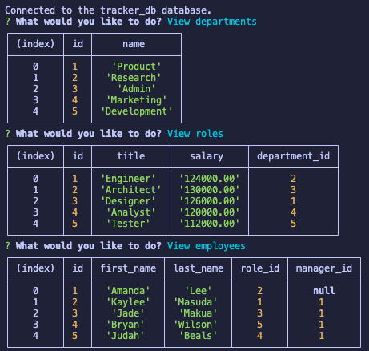
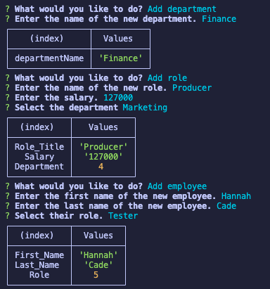

# Employee-Tracker

## Badges


## Table of Contents
- [License](#license)
- [Installation](#installation)
- [Tests](#tests)
- [Mock Up](#mock-up)
- [Usage](#usage)
- [Contact](#contact)


## License
Read more about the license here: [ICS](https://choosealicense.com/licenses/isc/)

## Installation

Run this command in an integrated terminal to install inquirer.
```
npm i inquirer@8.2.4
```

## Tests
To test the application, run this code in the CLI:
```
npm start
```

## Mock Up


## Usage
Watch the walkthrough of how ot use the application in the CLI:
[Employee Tracker](https://user-images.githubusercontent.com/113318764/215958190-35f55676-b673-42cf-a2dc-b03db2b21294.webm)

**View the database:**  
  

**Add to the database:**  



## Contact

### Questions? Reach me here:  
Github: Amandagl1  
Email: leeandama87@gmail.com

